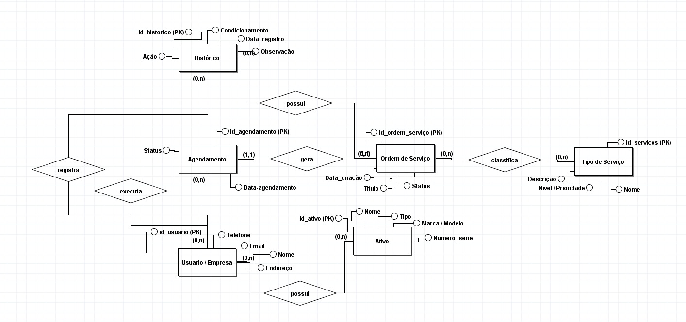
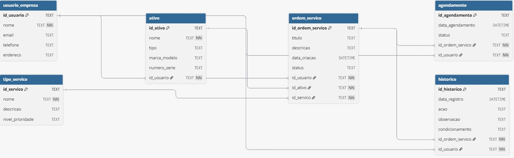

## 📅 Sistema_agendamento 

Sistema Web para agendamento de tarefas, desenvolvido com foco em organização e produtividade.

## 🚀 Tecnologias utilizadas

## ⚙️ Como rodar
## 📸 Screenshots
## 🗄️ Banco de Dados

## 📌 Funcionalidades

Cadastro e histórico de clientes:  
Armazena dados dos clientes e histórico de agendamentos para agilizar o atendimento e personalizar o serviço.  

Planejamento de Tarefas:  
Permite que clientes marquem, reagendem ou cancelem consultas/serviços a qualquer hora, sem depender da recepção.  

Calendário e Disponibilidade em Tempo Real:  
Exibe horários disponíveis instantaneamente, evitando choques de agenda e duplicidade de marcações.

Gestão de Fila de Espera:  
Organiza automaticamente quem aguarda uma vaga, preenchendo horários vagos rapidamente em caso de cancelamento.

## 👨‍💻 Autor

- [Wiliam de Amorim Barreto](https://github.com/W1ll-Amorim)
- [João victor de Oliveira Cavalcante](https://github.com/Victoroliveira07)
- [Lohan da Silva](https://github.com/LilNavaHoods)
- [Gabriel Ferreira da Silva](https://github.com/bielgb13)
