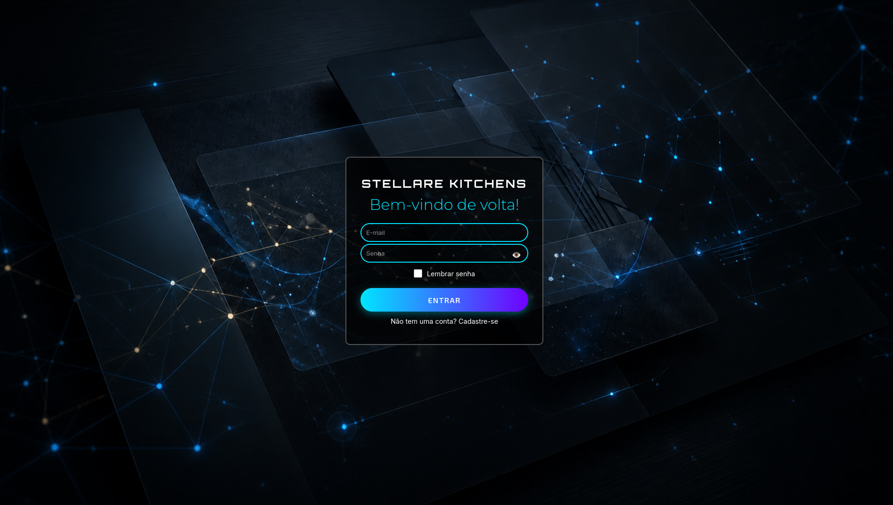
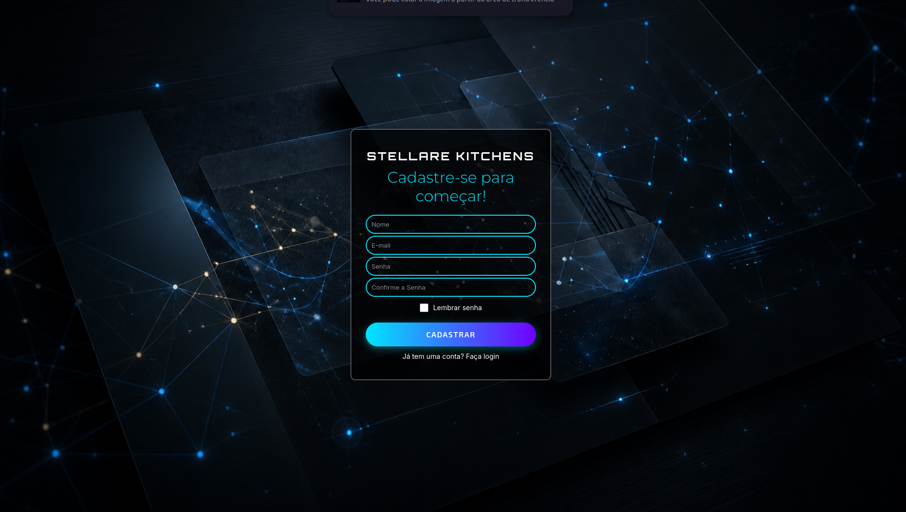
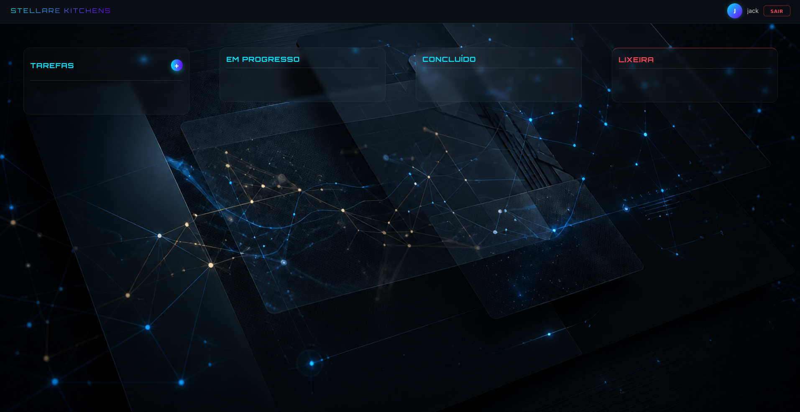

# 📅 Sistema de agendamento 

Sistema Web para agendamento de tarefas, desenvolvido com foco em organização e produtividade.

## 🗺️ Roadmap do Projeto

### ✅ Concluído (Base do Sistema)
- [x] Modelagem inicial do banco de dados (SQLite).
- [x] CRUD completo de usuário e agendamentos.
- [x] Funcionalidade de verificação de horários disponíveis.

### 🚧 Em Andamento (Transição para v2.0)
- [x] Migração de banco de dados para PostgreSQL para maior escalabilidade.
- [x] Implementação do Alembic para versionamento do esquema de dados.
- [x] Conteinerização da aplicação (Docker e Docker Compose).
- [ ] Refatoração completa da Interface de Usuário (UI).
- [ ] Ajustes de responsividade para dispositivos móveis.

### 📅 Planejado (Futuro)
- [ ] Integração com sistema de notificações (Email/WhatsApp).
- [ ] Dashboard analítico com métricas de agendamento para administradores.
- [ ] Configuração de pipeline de CI/CD via GitHub Actions.

## 🚀 Tecnologias Utilizadas


---
## 🔐 Segurança


---
## 🛠️ Fluxo de Desenvolvimento

### Estratégia de Branching
Este projeto utiliza o modelo de ramificação para garantir a estabilidade da versão principal e organizar o trabalho em equipe:

* **`main`**: Contém o código estável e pronto para uso (produção).
* **`develop`**: Branch de integração para novas funcionalidades antes de irem para a main.
* **`feature/nome-da-feature`**: Branches temporárias para o desenvolvimento de recursos específicos (ex: `feature/agendamento-apscheduler`).

---

## 📌 Funcionalidades

* **Cadastro e histórico de clientes:** Armazena dados dos clientes e histórico de agendamentos para agilizar o atendimento e personalizar o serviço.
* **Planejamento de Tarefas:** Permite que clientes marquem, reagendem ou cancelem consultas/serviços a qualquer hora.
* **Calendário e Disponibilidade em Tempo Real:** Exibe horários disponíveis instantaneamente, evitando choques de agenda e duplicidade de marcações.
* **Gestão de Fila de Espera:** Organiza automaticamente quem aguarda uma vaga, preenchendo horários vagos rapidamente em caso de cancelamento.

---

## ⚙️ Como Rodar o Projeto

1. **Clone o repositório:**
   ```bash
   git clone https://github.com/W1ll-Amorim/Sistema_agendamento.git

## 📸 Screenshots





## 🗄️ Banco de Dados


## 👨‍💻 Autor Principal
<div align="center">
  <a href="https://github.com/W1ll-Amorim">
    <br>
    <sub><b>Wiliam de Amorim</b></sub>
  </a>
  <br>
  <i>Desenvolvedor Principal</i>
  <br><br>
  <a href="https://www.linkedin.com/in/wiliam-amorim-241784331" target="_blank">
    
  </a>
</div>

---

## 🤝 Contribuidores

| [<br><sub>João Victor</sub>](https://github.com/Victoroliveira07) | [<br><sub>Lohan da Silva</sub>](https://github.com/LilNavaHoods) | [<br><sub>Gabriel Ferreira</sub>](https://github.com/bielgb13) |
| :--- | :--- | :--- |
| <sub>*Vaga aberta para sua PR!*</sub> |
