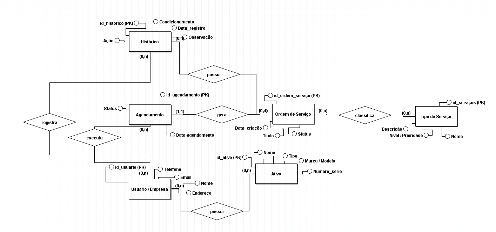
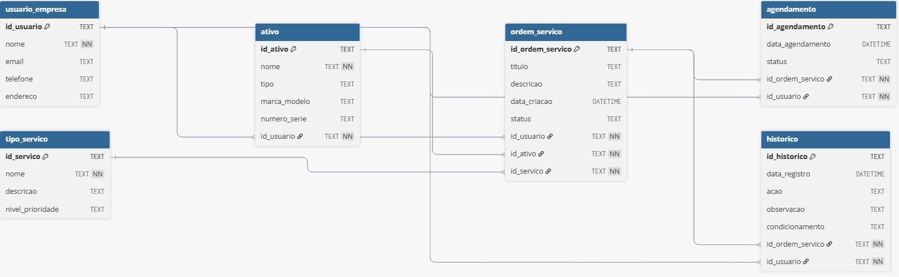

# 📅 Sistema_agendamento 

Sistema Web para agendamento de tarefas, desenvolvido com foco em organização e produtividade.

## 🚀 Tecnologias Utilizadas


---
## 🔐 Segurança


---
## 🛠️ Fluxo de Desenvolvimento

### Estratégia de Branching
Este projeto utiliza o modelo de ramificação para garantir a estabilidade da versão principal e organizar o trabalho em equipe:

* **`main`**: Contém o código estável e pronto para uso (produção).
* **`develop`**: Branch de integração para novas funcionalidades antes de irem para a main.
* **`feature/nome-da-feature`**: Branches temporárias para o desenvolvimento de recursos específicos (ex: `feature/agendamento-apscheduler`).

---

## 📌 Funcionalidades

* **Cadastro e histórico de clientes:** Armazena dados dos clientes e histórico de agendamentos para agilizar o atendimento e personalizar o serviço.
* **Planejamento de Tarefas:** Permite que clientes marquem, reagendem ou cancelem consultas/serviços a qualquer hora.
* **Calendário e Disponibilidade em Tempo Real:** Exibe horários disponíveis instantaneamente, evitando choques de agenda e duplicidade de marcações.
* **Gestão de Fila de Espera:** Organiza automaticamente quem aguarda uma vaga, preenchendo horários vagos rapidamente em caso de cancelamento.

---

## ⚙️ Como Rodar o Projeto

1. **Clone o repositório:**
   ```bash
   git clone https://github.com/W1ll-Amorim/Sistema_agendamento.git

## 📸 Screenshots
## 🗄️ Banco de Dados



## 👨‍💻 Autores

| [<br><sub>Wiliam de Amorim</sub>](https://github.com/W1ll-Amorim) | [<br><sub>João Victor</sub>](https://github.com/Victoroliveira07) | [<br><sub>Lohan da Silva</sub>](https://github.com/LilNavaHoods) |
| :---: | :---: | :---: |
| [<br><sub>Gabriel Ferreira</sub>](https://github.com/bielgb13) | [<br><sub>Allan Fernandes</sub>](https://github.com/allawder09-source) | [<br><sub>Davi Sena</sub>](https://github.com/davifsena-nv) |
